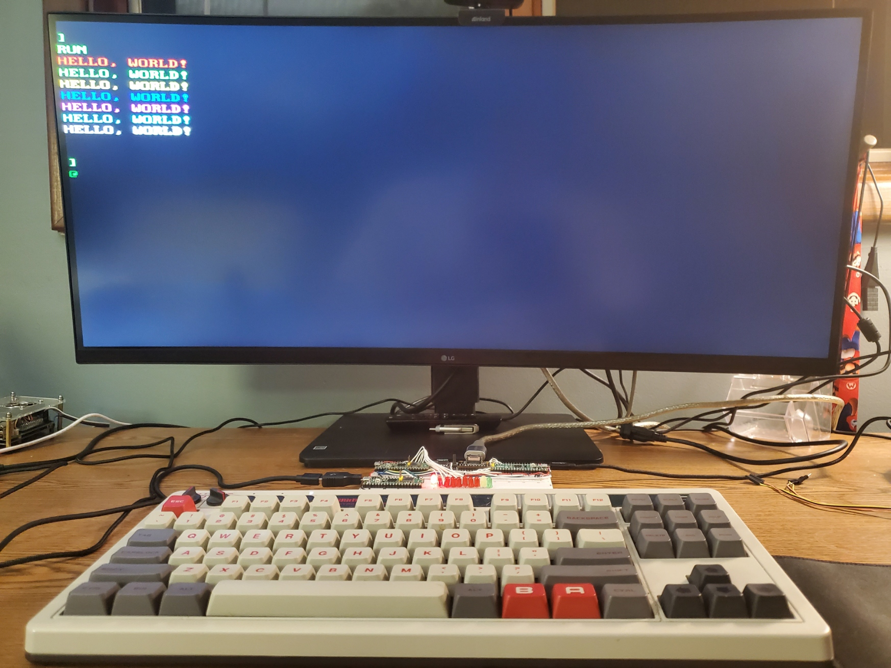

# PicoDVI-UART-Terminal



This project is a specialized DVI terminal emulator for the Raspberry Pi Pico RP2350, building upon the original [PicoDVI](https://github.com/Wren6991/PicoDVI) project. It provides a robust text-based console experience leveraging the Pico's DVI output capabilities and a UART interface for input.

**Author:** Donald R. Moran
**License:** MIT

## Features

*   **Display:** 80x30 character display (640x480 resolution) with double-buffered, VSYNC-synchronized rendering to prevent tearing.
*   **ANSI Support:** Comprehensive support for ANSI escape sequences, including text formatting, cursor positioning (e.g., `ESC[<row>;<col>H`), movement (`ESC[A`, `ESC[B`, `ESC[C`, `ESC[D`), screen/line erasing (`ESC[2J`, `ESC[K`), and saving/restoring cursor position (`ESC[s`, `ESC[u`). Also supports blinking text (`ESC[5m` to enable, `ESC[25m` to disable).
*   **Input:** UART interface for keyboard input, enabling a simple serial console experience. This version is specifically designed for ease of implementation with other systems via UART. It features robust line ending handling for both Carriage Return (CR) and Line Feed (LF) characters. By default, the UART operates at 115,200 baud, 8 data bits, no parity, and 1 stop bit (8N1), but these settings can be easily adjusted in the code. Supports Microsoft BASIC input.
*   **Color System:** Utilizes a 6-bit RGB color system (64 colors total, 2 bits per component). Colors can be set via ANSI escape sequences, interactive menus (Ctrl+F for foreground, Ctrl+B for background), or predefined theme presets (Ctrl+T).
*   **User Experience:** Features multiple configurable cursor styles (IBM retro, underline, bar, Apple I, shaded block, arrow), interactive color selection menus, and vertical scrolling when new lines exceed screen height. Terminal state is preserved during menu operations.
*   **System Stability:** Includes a watchdog timer for enhanced system stability.
*   **Performance:** Leverages multicore processing (Core0 for logic, Core1 for DVI rendering) for efficient operation.

## Hardware Requirements

*   Raspberry Pi Pico RP2350
*   DVI output board (e.g., [Adafruit DVI Sock for Pico](https://learn.adafruit.com/adafruit-dvi-sock-for-pico-works-with-hdmi-displays) or a DVI breakout board like [this one](https://www.adafruit.com/product/4984)). This project is configured to output DVI signals from the Raspberry Pi Pico RP2350 using the following GPIO pins. Ensure your DVI output hardware is wired to match these assignments:
    *   **D0 (Red):** GP12
    *   **D1 (Green):** GP18
    *   **D2 (Blue):** GP16
    *   **Clock:** GP14
*   UART connection for keyboard input (RX: GPIO1)

## Configuration

The UART communication parameters can be easily modified in `software/apps/my_terminal/main.c`. Look for the following lines:

```c
#define UART_ID uart0 // Or uart1
#define BAUD_RATE 115200
#define UART_RX_PIN 1 // GPIO pin for UART RX
```
Adjust `BAUD_RATE` as needed. Other UART settings (data bits, parity, stop bits) are configured in the `uart_set_format` function within `main.c`.

# PICO_PLATFORM can also be rp2350-riscv

Build instructions:

You can compile the project using CMake, or for a quick build, use the provided `compile.sh` script located in `software/apps/my_terminal/`.

**Using CMake:**
```bash
cd PicoDVI-pico2_UART/software
mkdir build
cd build
cmake ..
make -j$(nproc)
```

**Using compile.sh:**
```bash
cd PicoDVI-pico2_UART/software/apps/my_terminal
./compile.sh
```

# Then flash a binary, e.g.:
cd software/build/apps/my_terminal
picotool load my_terminal.uf2 -F
picotool reboot

